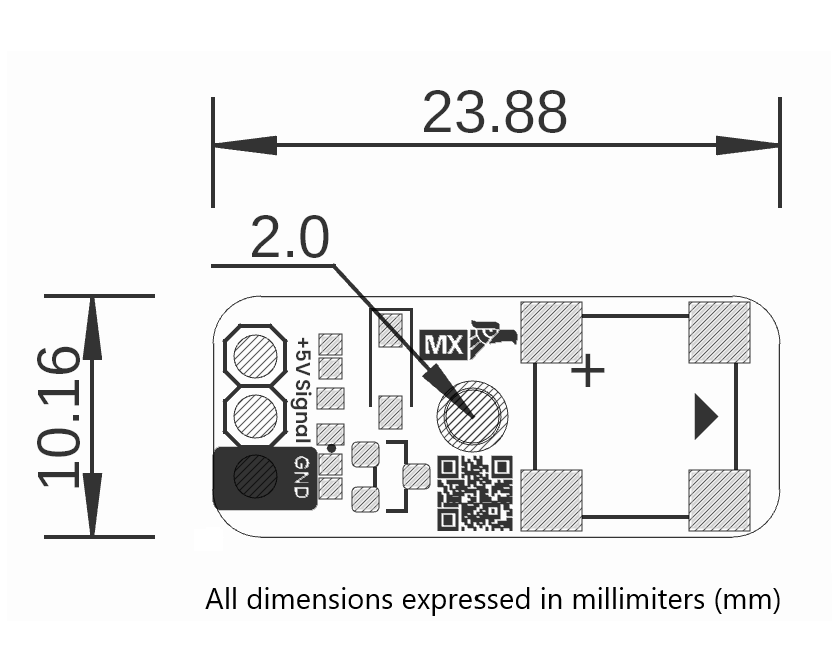

<!--
# README_TEMPLATE.md
Este archivo sirve como entrada para generar un PDF técnico estilo datasheet.
Edita las secciones respetando el orden, sin eliminar los encabezados.
-->
 <!-- logo -->

# UNIT Buzzer Module

## Introduction

The UNIT Buzzer Module is a compact and easy-to-integrate passive buzzer designed for embedded systems and prototyping. It features a standard 3-pin interface consisting of VCC (5V), Signal, and GND, allowing direct connection to popular microcontrollers such as Arduino, ESP32, CH552, and STM32.

This module is intended for generating audible alerts in systems that require alarms, notifications, timing events, or user interaction feedback. It includes a pre-mounted passive buzzer element and supporting circuitry, enabling it to be driven directly from a digital output or PWM-capable GPIO pin.

When a PWM signal is applied, the frequency determines the pitch of the tone produced by the buzzer. This approach provides flexibility to generate different sounds based on system state, user input, or event priority.

## Functional Description

The UNIT Buzzer Module integrates a passive piezoelectric transducer, which produces sound by converting electrical oscillations into mechanical vibrations. Unlike active buzzers, this module lacks an internal oscillator and requires an external signal source to operate.

Sound is generated when a square wave or PWM signal is applied to the Signal input pin. The frequency of this signal determines the pitch of the sound, while the duty cycle can influence the perceived volume and clarity. For best results, the input frequency should fall within the typical audible range of 500 Hz to 5 kHz.

The module's compact PCB includes clearly labeled VCC, Signal, and GND pins for easy connection to a microcontroller or signal generator. Due to its passive nature, the buzzer remains silent unless driven by a toggling signal.

## Electrical Characteristics & Signal Overview

- Operating Voltage: 3.0 V – 5.5 V (5 V recommended for optimal sound pressure)
- Current Consumption: Typically between 5 mA and 30 mA depending on frequency and supply voltage
- Input Signal Type: PWM or square wave, externally generated
- Frequency Range: 500 Hz – 5 kHz
- Logic Compatibility: Accepts 3.3 V and 5 V logic levels (TTL compatible)
- Input Impedance: High, acts as capacitive load to the signal pin

## Applications

- Audio indication for buttons or events
- Timers and countdown alerts
- Warning and alarm systems
- Feedback for embedded user interfaces
- Educational or DIY electronics kits

## Features

- Requires external PWM signal (passive buzzer type)
- Compact module with 3-pin interface
- Wide voltage range (3.0 V to 5.5 V)
- Clear tone generation based on input frequency
- Breadboard-friendly layout
- Low power consumption

## Pin & Connector Layout

| PIN     | Description              |
|---------|--------------------------|
| VCC     | MCU logic voltage (5V)   |
| Signal  | Digital or PWM input     |
| GND     | Ground                   |

## Settings

### Interface Overview

| Interface  | Signals / Pins      | Typical Use                          |
|------------|---------------------|--------------------------------------|
| Digital    | Signal               | Accepts PWM from MCU                 |
| Power      | VCC, GND             | Connects to 5 V supply and ground    |

### Supports

| Symbol | I/O   | Description                         |
|--------|-------|-------------------------------------|

## Block Diagram

## Dimensions

## Usage

Works with:

- Arduino AVR
- Raspberry Pi RP2040
- STM32
- NRF
- PY32
- MAX II

## Downloads

<<<<<<< HEAD
- [Schematic PDF](https://github.com/UNIT-Electronics-MX/unit_buzzer_module/blob/main/hardware/unit_sch_v_1_1_0_ue0088_modulo_buzzer.pdf)
=======
[Schematic PDF](../../hardware/unit_sch_v_1_1_0_ue0088_modulo_buzzer.pdf)
>>>>>>> origin

## Purchase

- [Buy from UNIT Electronics](https://www.uelectronics.com)
